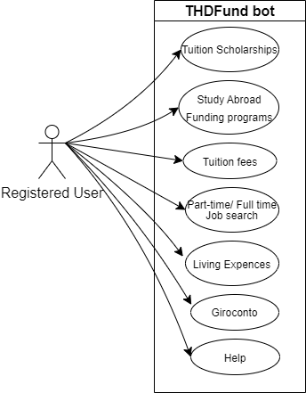

Chatbot assistant focuses on solving common money-related problems.

-------------------------------------------------------------------------------

# Funding-related (searching for appropriate scholarship) Use-cases

- Context: At some point, a student may face financial difficulties. He may overcome these issues by applying for funding/scholarship. The main intent of a user is to raise funds. In order to do that, he needs to gather information that concerns this process. That is what the chatbot does.
---------------------------------------
## 1) Tuition scholarships
1. **Use Case name**: Tuition scholarships
2. **Persona:** Bobane
3. **Context:** Person is experiencing financial difficulties during his tuition, so he wants to know about scholarships
4. **Steps:** 
* The user may request information about scholarship options.
* Bot will ask the user about the specific scholarship he's interested in, alternatively he gives an option to showcase the list of available scholarships
* Next, the user needs to clarify, which option he is interested in.
* After that bot will either showcase the list of scholarship, or ask about what exact information user would like to get about the scholarships he's interested in: deadlines, prerequisites, and where to find more detailed information.
* User specifies what information he would like to know
* Bot provides the information  

5. **Errors and problems during the execution.**
- Chatbot may face difficulties recognising the name of the scholarships: usually, they are very weird, so a user may make a typo
- Bobane may ask repetitive or irrelevant questions. The assistant should handle this by either guiding Bobane back to the main topic or initiating a fall-back reply off-topic question.

## 2) Study Abroad Funding programs
1. **Use Case name**: Study Abroad Funding programs
2. **Persona:** Julianne
3. **Context:** Julianne is planning to spend next semester abroad; That is why she is searching for appropriate funding.
4. **Steps:**  
 * User may request to gather information about available scholarships for a semester abroad
 * The bot will provide the list of funding programs. 
 * The user needs to clarify, which option he is interested in.
 * Shortly after that, the user is provided with a set of options: information about the funding: country, university, prerequisites, and where to find more detailed information. 
 * User specifies what information he's interested in
 * Bot provides relevant information.

5. **Errors and problems during the execution.**
- Chatbot may face difficulties recognising the names of the funding programmes, and universities.
  

# Other money-related issues
## 3) Provide information concerning tuition fees, registration procedure
1. **Use Case name**: Reregistration, fees
2. **Persona:** Dmytro
3. **Context:** As we know, Dmytro always forgets about important events. This time he forgot about tuition fees. He does not know anything about the procedure, but he needs to re-register.
4. **Steps:** Asking about the tuition fees, some prompts will appear to navigate through related topics. 
 * A user can request information about cost of tuition, registration procedure,
 * Bot will ask to specify what information about tuition fees or registration procedure user is interested in
 * User specifies the request
* Responds with relevant information based on user request

5. **Errors and problems during the execution.**
- Technical issues may occur during the execution process. Fall-back mechanism, that could annoy the user

## 4) Part-time/Full-time job search
1. **Use Case name**: Job search
2. **Persona:** Bobane
3. **Context:** Person is experiencing financial difficulties during his tuition, so he wants to know about job offers
4. **Steps:** 
* A user can requests information about jobs
* He will be asked to choose between offer list, offers from the university, discloses DIT partner companies.
* User specifies his job interest
* The bot gives relevant information according to the user's choice

5. **Errors and problems during the execution.**
- Bobane might ask irrelevant questions during the conversation. The assistant should handle this by either guiding Bobane back to the main topic or initiating a fall-back reply off-topic question.

## 5) Living Expenses
1. **Use Case name**: Living Expences
2. **Persona:** Olena
3. **Context:** Olena is moving to Deggendorf. She wants to estimate the cost of living in Deggendorf. Mia is also interested in learning about ways to reduce her living costs and make her student life more financially manageable.
4. **Steps:** 
 * User asks for information about student expenses in Deggendorf
 * A small draft of monthly expenses will be depicted. Thus, the user can understand how to form his budget for his/her studies.
 * Accordingly, work out possible ways of cost reduction.

- How expensive is living cost in Deggendorf as a student? - calculates the average that student in Deggendorf spends on living. 

5. **Errors and problems during the execution.**
- Very specific budgeting questions could not be answered because of the complexity of the field. The bot can provide only a limited amount of specific information

## 6) Opening a German bank account for International students (Girokonto)
1. **Use Case name**: Girokonto
2. **Persona:** Olena
3. **Context:**  Before coming to Germany Olena decides to get information about opening a German bank account 
4. **Steps:** 
 * Asking about a Bank Account, some prompts will appear to navigate through related topics.
 * A user requests information on necessary documents, recommended banks, and guidance on the account creation process.
 * The bot gives relevant information according to the user's choice

5. **Errors and problems during the execution.**
- For Detailed information user has to reach an authorised bank website of 

## 7) Help
1. **Use case name:** Help
2. **Persona:** any
3. **Context:** unfamiliarity with the bot's functionality may make the user experience more   dissatisfactory. That is why a small help hint should be implemented
4. **Steps:** 
* Provides an initial guide to the chatbot. Getting a user acquainted with the main functions of the bot.

5.**Errors and problems during the execution.**
  - None

